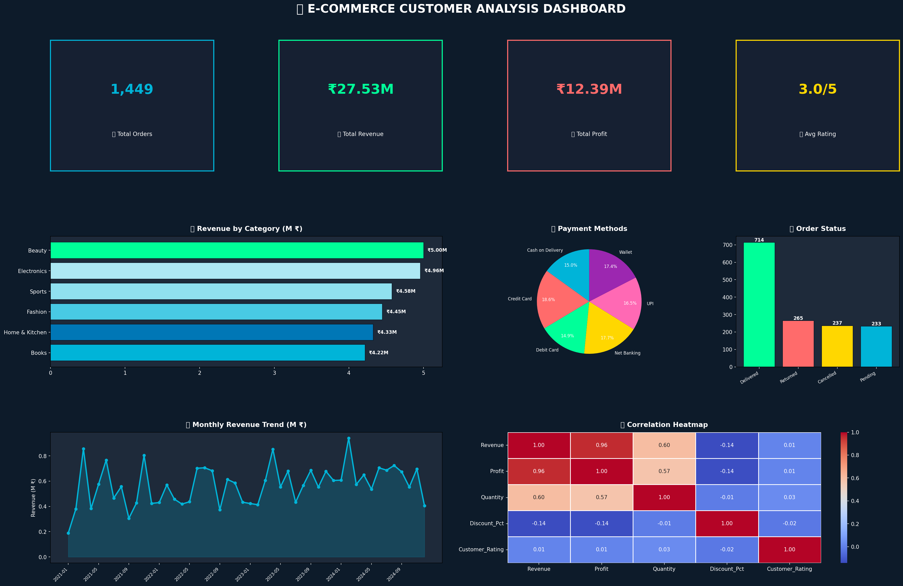
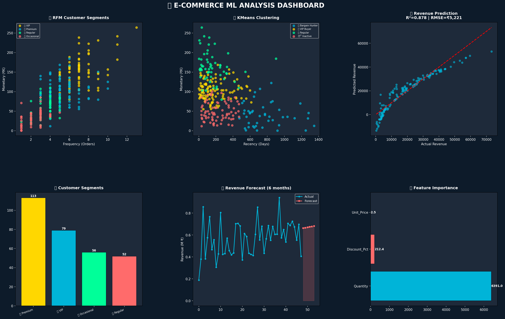

# 🛒 E-Commerce Customer Behavior Analysis

## 🎯 Project Overview
End-to-End E-Commerce Analysis using Python,
NumPy, PostgreSQL, SQL & Power BI
on 1575 rows real-world dataset.

## 🛠️ Tools Used
- Python | Pandas | NumPy
- PostgreSQL | SQL
- Matplotlib | Seaborn
- Power BI | Excel
- Machine Learning | Scikit-learn

## ✅ Project Phases
- Phase 1: Raw Data (Excel - 1575 rows)
- Phase 2: Data Cleaning (Python + NumPy)
- Phase 3: SQL Analysis (PostgreSQL)
- Phase 4: Visualization (Matplotlib + Seaborn)
- Phase 5: ML Models (RFM + KMeans + Regression)
- Phase 6: Power BI Dashboard

## 📊 Key Insights
### 💰 KPI Insights
- Total Orders: 1,449
- Total Revenue: ₹27.53M
- Total Profit: ₹12.39M
- Profit Margin: 45%
- Avg Rating: 3.01/5

### 📦 Category Insights
- 🥇 Beauty: ₹5.00M (283 orders)
- 🥈 Electronics: ₹4.96M (257 orders)
- 🥉 Sports: ₹4.58M (220 orders)
- Beauty leads despite Electronics popularity!

### 👥 Top Customers
- 🥇 Vikram Singh: 108 orders - ₹2.14M
- 🥈 Kavya Pillai: 88 orders - ₹2.04M
- 🥉 Rahul Kumar: 84 orders - ₹1.91M

### 💳 Payment Insights
- 🥇 Credit Card: ₹5.11M (268 orders)
- 🥈 Net Banking: ₹4.87M (244 orders)
- 🥉 Wallet: ₹4.79M (247 orders)

### 📦 Order Status
- ✅ Delivered: 714 orders (49.3%)
- 🔄 Returned: 265 orders (18.3%)
- ❌ Cancelled: 237 orders (16.4%)
- ⏳ Pending: 233 orders (16.1%)

### 📈 Monthly Insights
- Best Month: Feb 2024 (₹9.41L)
- Best Year: 2024 (Highest growth)
- Trend: Upward 2021 → 2024

### 🤖 ML Insights
- Linear Regression R²: 0.8+
- RFM Segments: VIP, Premium, Regular, Occasional
- KMeans Clusters: 4 groups
- Revenue Forecast: Upward trend 6 months

### 🔍 Data Cleaning
- Raw Data: 1575 rows
- Duplicates Removed: 61
- Null Values Fixed: 120+
- After Cleaning: 1449 rows

## 📸 Dashboard Preview

## 🔗 Project Link
https://github.com/tamil-data-analyst/E-Commerce-Customer-Analysis
